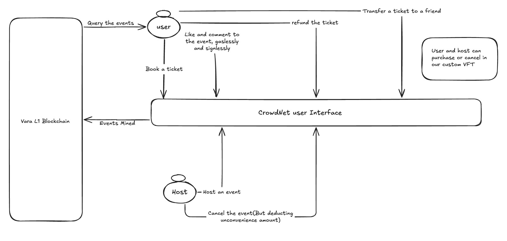

# CrowdNet

## Video Demo

## Inspiration

A decentralized event-hosting platform on the Vara network! Whether you're hosting or attending Web3 or general events, our platform makes it easy to create, join, and interact with events through likes and comments. Say goodbye to high taxes on crypto conversions – we use VFT tokens for all payments, making transactions fast and cost-effective. Join us to experience seamless, engaging events in a decentralized world!

## Presentation
PPT: 

## System Design 

## Description 

### How Vara benefits our platform ? 

### How does the platform work ?

### What real world problem does our platform intends to solve ? 

## Scope of this project 

## Contarct Address
